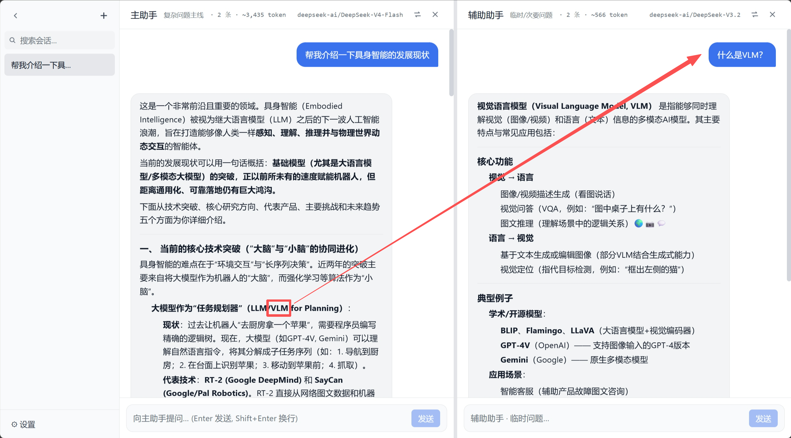

# BiLLM

<p align="center">
  
</p>

**两个 LLM，一个窗口。主线不被零碎问题拖垮。**

BiLLM 是一个本地运行的双栏大模型聊天 Web 应用。名称源自 **Bi（双）+ LLM**。其核心设计是在同一个会话中并排提供两个独立的 LLM 对话栏，互不干扰，旨在解决单一对话窗口中“主线任务”与“零碎追问”相互混杂的问题。

---

## 你有没有这种经历？

在一个聊天窗口里问着正经大项目，突然想顺手查个小语法、验个假设、或者问一句「这句话什么意思」—— 结果全堆进同一条上下文里。翻记录麻烦，token 悄悄涨，主线还被带偏。

**BiLLM** 就是为此做的：**Bi** = 两个 **LLM**，左右并排，各走各的上下文。

左边管会话，中间跑主线，右边接杂活——**互不污染**

<p align="center">
  
</p>

---

## 💡 解决的问题

在常规的单栏聊天界面中，用户若在同一个窗口里既讨论主线问题，又插入临时性的名词解释或零碎追问，会导致以下问题：
- **Token 膨胀**：不相关的临时讨论增加了后续对话的上下文长度，提高 API 消耗。
- **主线偏移**：模型容易被后续的零碎讨论带偏，降低主线任务的回答质量。
- **检索困难**：主线内容与杂乱的追问混杂在一起，难以快速定位关键信息。

**BiLLM 的解决方案：**
通过左右双栏将「主线」和「杂问」在物理空间和上下文上进行隔离。
- **左栏（主助手）**：处理复杂、长上下文、核心的主线任务。
- **右栏（辅助助手）**：处理临时、次要、名词解释等杂乱问题。
- **统一会话管理**：侧边栏管理会话列表，每一条会话同时包含且关联这两栏的消息记录。

---

## 🛠️ 技术架构

- **后端**：基于 **Python + FastAPI** 构建，使用 **SQLite** 进行本地会话与消息的持久化，通过 OpenAI 兼容的 SDK 调用各大模型 API，支持 **SSE（Server-Sent Events）** 流式响应。
- **前端**：基于 **Vite + React + TypeScript + Tailwind CSS** 构建，采用三栏布局（侧边栏 + 主栏 + 辅栏），开发模式下通过 `/api` 代理解决跨域问题。
- **配置管理**：大模型相关配置（API Key、Base URL、主/辅模型）统一保存在项目根目录的 **`config.json`**。设置页修改会实时写入该文件；也可直接编辑文件。前端每 2 秒轮询配置，界面会自动同步。

---

## 🌟 主要功能

### 1. 布局与 UI 交互
- **灵活布局**：侧边栏支持折叠与拖拽调节宽度。主栏与辅栏支持位置互换、单独关闭某一栏以及拖拽调节左右宽度。
- **布局锁定**：支持锁定当前布局，防止日常使用中误拖拽。
- **主题与标题**：支持日间/夜间模式切换。

### 2. 双栏独立对话
- **独立上下文**：每栏拥有独立的输入框与消息流，向大模型发起请求时仅携带本栏的历史消息。
- **流式输出**：支持 SSE 流式生成，点击停止按钮可中止上游 API 请求并保留已生成的文本。
- **Markdown 渲染**：支持标准的 Markdown 格式渲染，并对代码块进行高亮处理。

### 3. 主栏 → 辅栏协作
- **选区联动**：在主栏对话内容区选中文字后，可手动或自动将文字复制到辅栏的输入框中，支持配置“替换”或“追加”模式。标题栏、占位提示等系统 UI 文字不会触发此逻辑。

### 4. 消息与会话管理
- **消息操作**：悬停于消息上方可唤出工具栏，支持复制内容、重新生成、编辑后重发以及删除单条消息。
- **会话操作**：支持新建会话、删除会话、搜索会话，以及通过双击或点击铅笔图标对会话进行重命名。删除消息或更新会话后，侧边栏会根据最后活动时间自动重新排序。

### 5. 上下文与成本感知
- **Token 估算**：每栏头部实时显示当前栏的消息条数及估算的 Token 消耗（主/辅栏分开统计）。

### 6. 系统设置

设置面板采用左侧栏目 + 右侧内容的布局，包含 **外观**、**选区行为**、**模型 / API**、**关于** 四个分类。

**模型 / API（`config.json`）**

| 能力 | 说明 |
|------|------|
| 服务商模板 | 内置 OpenAI、Gemini、Anthropic、MiniMax、GLM、DeepSeek、Grok、Qwen、Kimi、硅基流动、自定义等，选中后自动填充 Base URL |
| 自动保存 | 修改 Base URL、API Key、主/辅模型后约 500ms 自动写入 `config.json`，无需点保存 |
| 连通性测试 | 可同时测试主、辅两个模型是否可用 |
| 模型交换 | 一键互换主/辅模型名 |
| 恢复默认 | 用 `config.example.json` 覆盖当前 `config.json`（需确认） |

**仅保存在浏览器本地的偏好**（不写 `config.json`）：

- 日间 / 夜间主题
- 布局锁定、选区复制行为等

**交互安全**：删除会话、恢复默认配置等敏感操作使用自定义确认框，而非浏览器原生 `confirm`。

---

## 📦 数据与部署

本工具定位为**个人或小团队的本地辅助工具**，并非多用户 SaaS 系统。

**本地文件分工：**

| 文件 | 内容 |
|------|------|
| `config.json` | API Key、Base URL、主/辅模型（含敏感信息，已 gitignore） |
| `config.example.json` | 配置模板，随仓库分发 |
| `billm.db` | 会话与消息记录 |

不依赖任何云端同步服务。

**一键启动：**

- **Windows**：双击 `start.bat`
- **macOS / Linux**：`bash start.sh`

启动脚本会在缺少 `config.json` 时从 `config.example.json` 复制一份。

---

## ⚙️ config.json 配置

BiLLM 的大模型相关配置统一保存在项目根目录的 **`config.json`**，前后端读写同一份文件。会话与消息仍在 `billm.db`，API / 模型配置**不写入数据库**。

| 文件 | 是否提交 Git | 用途 |
|------|--------------|------|
| `config.example.json` | 是 | 模板，不含真实 Key |
| `config.json` | 否（已 gitignore） | 实际运行配置 |

首次启动时，若不存在 `config.json`，启动脚本或后端会从 `config.example.json` 复制，或自动创建默认文件。

### 字段说明

```json
{
  "api_base_url": "https://api.openai.com/v1",
  "api_key": "sk-...",
  "model_main": "gpt-4o",
  "model_aux": "gpt-4o-mini"
}
```

| 字段 | 说明 |
|------|------|
| `api_base_url` | OpenAI 兼容 API 地址 |
| `api_key` | API Key（明文保存在本地） |
| `model_main` | 主栏模型名 |
| `model_aux` | 辅栏模型名 |

`config.json` 只存以上四项。前端轮询同步用的版本号由后端根据**文件修改时间**隐式计算，不会写入文件。`config.json` 含 API Key，**请勿提交到 Git**。

### 修改配置的三种方式

1. **设置页（推荐）** — 打开 **设置 → 模型 / API**，修改后约 500ms 自动写入 `config.json`。
2. **直接编辑文件** — 修改根目录 `config.json`；前端每 2 秒轮询，顶栏模型名会自动刷新；设置页打开且无未保存输入时，表单也会同步。
3. **恢复默认** — 设置页底部 **「恢复为默认配置」** 会用 `config.example.json` 覆盖 `config.json`（需确认）。

若使用硅基流动等国内服务商，将 `api_base_url` 改为对应地址即可（例如 `https://api.siliconflow.cn/v1`）。

---

## 🚀 快速开始

### 1. 克隆仓库
```bash
git clone https://github.com/The-Iron-Axe/BiLLM.git
cd BiLLM
```

### 2. 配置大模型

BiLLM 通过 **`config.json`** 配置 API，不再使用 `.env`。

**方式 A：启动后于网页填写（推荐）**

1. 先运行启动脚本（见下一步），会自动生成 `config.json`
2. 打开 **设置 → 模型 / API**，填入 API Key 并选择服务商 / 模型

**方式 B：启动前手动编辑**

```bash
cp config.example.json config.json   # Windows: copy config.example.json config.json
```

编辑 `config.json` 中的 `api_base_url`、`api_key`、`model_main`、`model_aux` 即可。字段含义见上文 **config.json 配置**。

### 3. 本地运行
- **Windows 用户**：直接双击运行根目录下的 `start.bat`。
- **macOS / Linux 用户**：
  ```bash
  chmod +x start.sh
  ./start.sh
  ```
脚本会自动检查依赖环境，初始化前端与后端服务，并在浏览器中打开对应页面。

---

## 📄 开源协议

本项目基于 [Apache License 2.0](LICENSE) 协议开源。